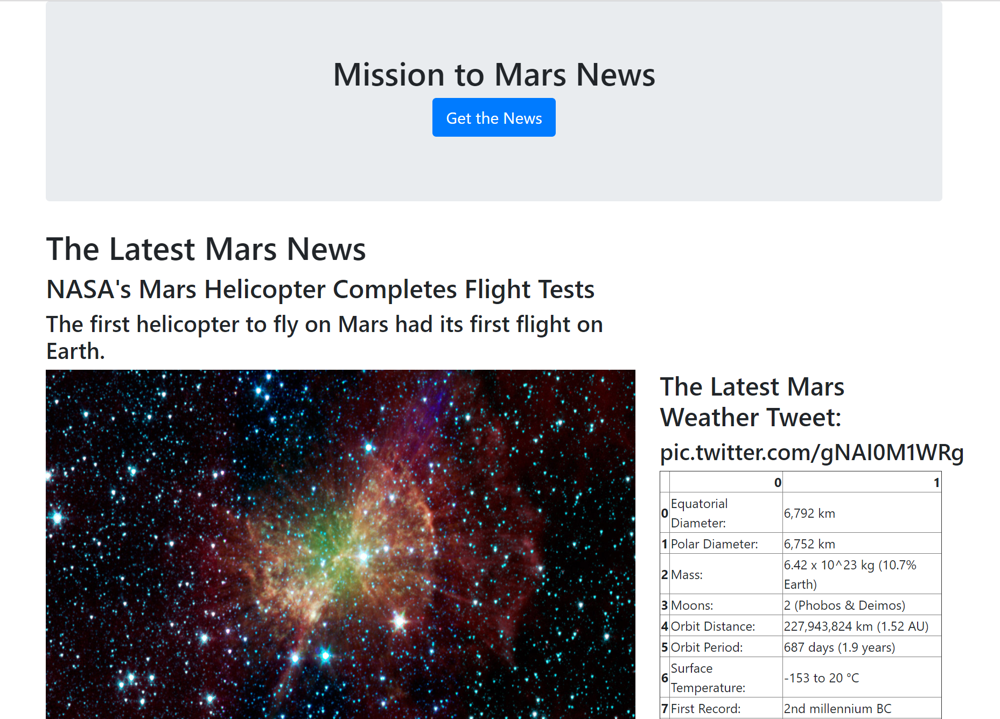
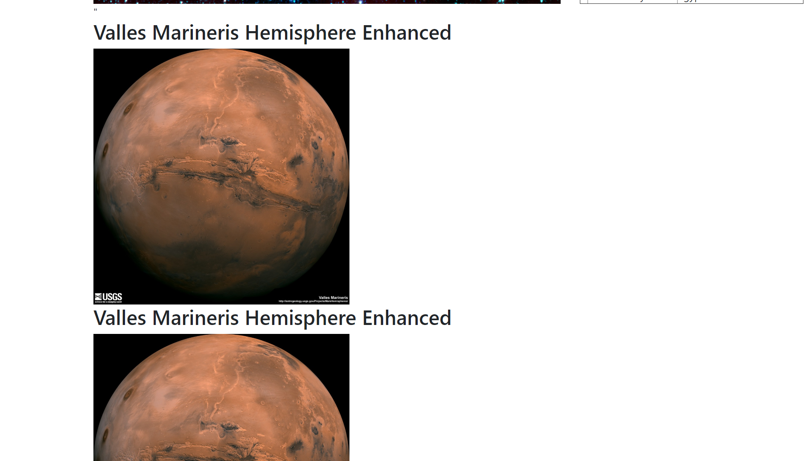

# Mars in the News ETL and Dashboard

This repository uses ETL concepts to build a web application that scrapes various websites for data related to the Mission to Mars. The information is then displayed in a single HTML page. 

## Extract data via web scraping and performed necessart data transformations

Conducted web scraping using BeautifulSoup, Python Pandas, and Requests/Splinter.

### What needed to be web scraped:

### NASA Mars News

* Scraped the [NASA Mars News Site](https://mars.nasa.gov/news/) and collected the latest News Title and Paragraph Text.

### JPL Mars Space Images - Featured Image

* Visited the url for JPL Featured Space Image [here](https://www.jpl.nasa.gov/spaceimages/?search=&category=Mars).

* Navigated the site and found the image url for the current Featured Mars Image and assign the url string to a variable called `featured_image_url`.

### Mars Weather

* Visited the Mars Weather twitter account [here](https://twitter.com/marswxreport?lang=en) and scraped the latest Mars weather tweet from the page.

### Mars Facts

* Visited the Mars Facts webpage [here](http://space-facts.com/mars/) and used Pandas to scrape the table containing facts about the planet including Diameter, Mass, etc.

* Used Pandas to convert the data to a HTML table string.

### Mars Hemispheres

* Visited the USGS Astrogeology site [here](https://astrogeology.usgs.gov/search/results?q=hemisphere+enhanced&k1=target&v1=Mars) to obtain high resolution images for each of Mar's hemispheres.

## Loading the data in MongoDB and creation of a Flask Application

The scraped and transformed data was loaded into MongoDB. Used Flask templating, HTML, and CSS code to create a new HTML page that displays all of the information that was scraped from the URLs above.

## Application Screenshot

## Planet Hemisphere Images Scraped

